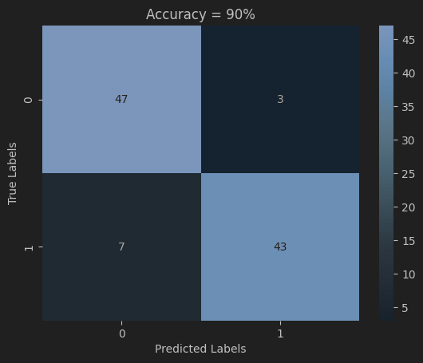

## Syscall-IDS

Host-based Intrusion Detection System (HIDS) that identifies anomalies in system call traces by leveraging a combination of statistical and machine learning techniques to distinguish between normal (clean) and potentially malicious (infected) behaviors.

View pipeline [here](https://github.com/Vismay-dev/SysCall-IDS/blob/main/notebooks/subcom_pipeline.ipynb).

### 🌟 Key Developments

| Technique/Feature                   | Description                                                                          |
|-------------------------------------|--------------------------------------------------------------------------------------|
| Feature Engineering                 | Conversion of syscall info into high-dimensional feature vectors.                    |
| Probabilistic Syscall Subclustering | Gaussian mixture models for granular syscall behavior understanding.                 |
| Temporal Dependency Modeling        | Markov chains capture transitions between syscall states as a function of time.      |
| Buffer Overflow Detection           | Gaussian interval of string argument lengths to catch overflow attempts.             |
| Pathname Similarity Analysis        | Self-organizing maps to visualize and detect anomalies in syscall pathnames.                         |
| DoS Attack Detection                | Markov chain edge frequency analysis per-trace for DoS detection.                    |
| Segmentation                        | Autocorrelation + suffix trees to segment traces and proces each segment seperately. |

### 📊 Results

Below are the confusion matrices showing the performance of the HIDS pipeline on the Twindroid dataset:

a) **Average-Case Confusion Matrix:**

b) **Best-Case Confusion Matrix:**

### 🎓 References:

- [Liao et al. "Anomaly Detection of System Call Sequence Based on Dynamic
Features and Relaxed-SVM"](https://typeset.io/papers/anomaly-detection-of-system-call-sequence-based-on-dynamic-1oukdqgy)
- [Shamim et al. "Efficient Approach for Anomaly Detection in IoT Using System Calls"](https://www.mdpi.com/1424-8220/23/2/652)
- [Frossi et al. "Selecting and Improving System Call Models for Anomaly Detection"](https://maggi.cc/publication/frossi_hybridsyscalls_2009/frossi_hybridsyscalls_2009.pdf)
- [Android Dataset](https://ieeexplore.ieee.org/document/9796248)

### 🙏 Acknowledgments:

- [Cosma Shalizi's Notes on Markov Chains and Prediction Processes](http://bactra.org/notebooks/prediction-process.html)
- [Columbia CS Dept's Intrusion Detection Pipeline](http://ids.cs.columbia.edu/sites/default/files/smt-syscall-discex01.pdf)

## 📝 License

This project is licensed under [the GNU Affero General Public License v3.0](https://www.gnu.org/licenses/agpl-3.0.en.html).
